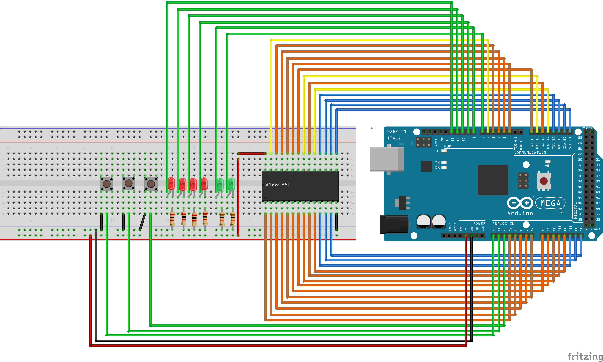

EEPROM Programmer
=================

The EEPROM programmer is used to read and write data from/to the EEPROM chips.
It's loosely based on the `EEPROM Programmer`_ by :ref:`ben_eater`.

.. _EEPROM Programmer: https://github.com/beneater/eeprom-programmer

Hardware
--------

The EEPROM programmer uses an Arduino Mega rather than a Nano as extra flash
storage space was required to fit all the ROM bytes on the Arduino.

It is wired up as follows:

The three buttons from left to right control:

- Which ROM (0-3) to write to the EEPROM.
- Which mode the programmer is in (read or write).
- When to perform the read or write (the "Go" button).
  
The red LEDs indicate which ROM is selected (the leftmost LED is 0, the one to
the right of that 1, and so on).

The green LEDs indicate which mode, the left LED means read mode, the right LED
means write mode.

When reading, the contents of the EEPROM are sent over the Arduino Serial port
to the monitor. When writing, updates on the progress of the write are sent over
the Arduino Serial port to the monitor.

Software
--------

The Arduino sketch to read and write the ROMS can be found in the
`Arduino section`_ section of the project

.. _Arduino section: https://github.com/ninezerozeronine/eight-bit-computer/tree/master/arduino

Page Write
^^^^^^^^^^

Unlike the smaller EEPROM used by :ref:`ben_eater`, the larger AT28C256 EEPROM
used in this computer writes bytes in 64 byte pages. This means that sequential
writes of more than 64 bytes, too close together in time will eventually fail as
the chip enters a write period and then subsequent writes will not be
successful.

To avoid this it's possible to:

- Use the chips built in polling feature to detect the end of a write period.
- Only write one page worth of bytes at a time.

This sketch uses the latter approach, and pauses longer than the maximum
specified write period (10ms from the datasheet) between each page to let the
write operation complete.

Maximum Array Size
^^^^^^^^^^^^^^^^^^

The maximum array size on an Adruino is 32767 bytes. As the ROM is 32768 bytes
this means the last byte of the array needs to be stored separately. `This
page`_ was helpful to clarify this. 

.. _This page: http://arduino.land/FAQ/content/6/7/en/what-is-the-maximum-number-of-elements-an-array-can-have.html

Large amounts of PROGMEM data
^^^^^^^^^^^^^^^^^^^^^^^^^^^^^

The PROGMEM_ macro in Arduino allows you to compile data into program memory
rather than being declared as data in RAM as it typically is. 

.. _PROGMEM: https://www.arduino.cc/reference/en/language/variables/utilities/progmem/

When storing large amounts of data this way the compiler needs extra
instructions to place the data correctly so instead of using the typical
``PROGMEM`` macro, ``__attribute__ (( __section__(".fini1") ))`` needs to be
used instead. The ``fini1`` can be replaced with ``fini<int>`` for each large
chunk. (This a vast simplification/assumption). `A post`_ on the
Arduino forums helped clarify this.

.. _A post: https://forum.arduino.cc/index.php?topic=387506.msg2676442#msg2676442

The typical ``pgm_read_byte_near`` function also needs to be replaced with
``pgm_read_byte_far`` which needs an address returned by ``pgm_get_far_address``
which must be passed a compile time constant. `This post`_ on the
AVRFreaks forums helped clarify this.

.. _This post: https://www.avrfreaks.net/comment/502866#comment-502866