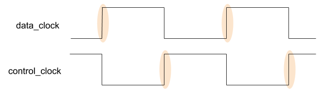
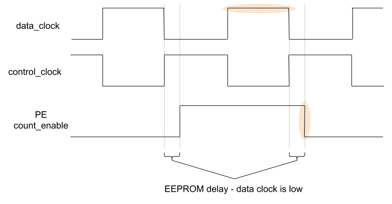
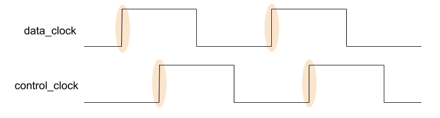
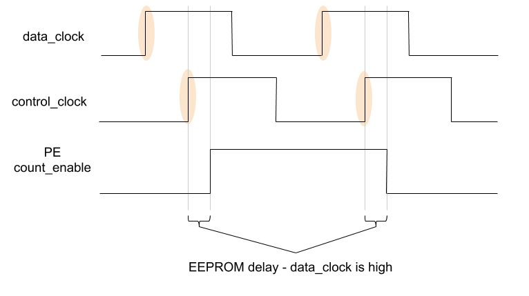
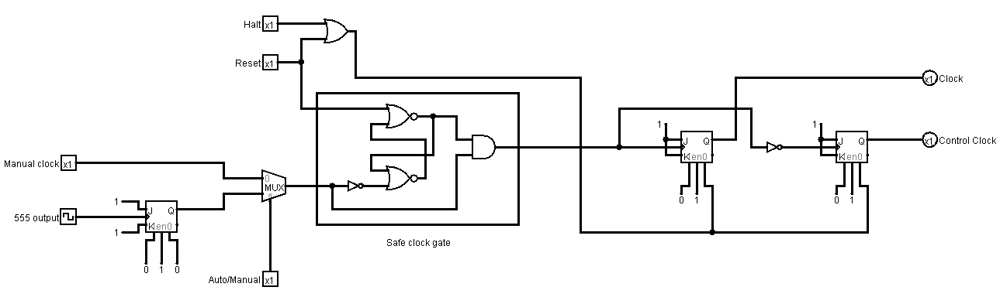

.. _clock_module:

Clock
=====

The clock produces signals that synchronise the operation of all the other
modules in the computer.

It can drive the operation of the computer step by step for debugging or at an
arbitrary speed.

Interface and Operation
-----------------------
  
This is the interface to the clock:

.. image:: images/clock/clock_block.png

And this is how it operates:

+--------------------+-----------+---------------------------------------------------------------------------------------------------------------------------+
| Name               | Bit width | Description                                                                                                               |
+====================+===========+===========================================================================================================================+
| auto/manual        | 1         | When low, the clock signals are advanced manually with manual_input. When high, clock singals are advanced automatically. |
+--------------------+-----------+---------------------------------------------------------------------------------------------------------------------------+
| manual_clock_input | 1         | High/low transitions here will advance the clock signals.                                                                 |
+--------------------+-----------+---------------------------------------------------------------------------------------------------------------------------+
| halt               | 1         | While high, bring both of the clock signals low and stop them advancing.                                                  |
+--------------------+-----------+---------------------------------------------------------------------------------------------------------------------------+
| reset              | 1         | While high, bring both of the clock signals low and stop them advancing.                                                  |
+--------------------+-----------+---------------------------------------------------------------------------------------------------------------------------+
| data_clock         | 1         | Alternates between high and low, driving the data transitions in the computer.                                            |
+--------------------+-----------+---------------------------------------------------------------------------------------------------------------------------+
| control_clock      | 1         | Alternates between high and low, driving the control signal transitions in the computer.                                  |
+--------------------+-----------+---------------------------------------------------------------------------------------------------------------------------+

Control and Data Clocks
^^^^^^^^^^^^^^^^^^^^^^^

Typically the clocks in other computers invert data_clock to create
control_clock, like this:

This is not suitable for this computer due to a couple of notes in the 74HCT161
datasheet:

.. note::
    2. The High-to-Low transition of PE or TE on the ’HC/HCT161 and the
       ’HC/HCT163 should only occur while CP is HIGH for conventional
       operation.
    3. The Low-to-High transition of SPE on the ’HC/HCT161 and SPE or MR
       on the ’HC/HCT163 should only occur while CP is HIGH for
       conventional operation.

Control signal changes must happen while data_clock is high. The inverted clock
method doesn't satisfy this constraint as control signal changes (which happen a
short delay after the rising edge of control_clock would occur after data_clock
had gone low. The delay is introduced by the EEPROMs in the :ref:`control_unit`
settling after a new instruction/flag/micro-step value goes onto their address
lines. This demonstrates the problem using the PE control (_SPE is the same):

To satisfy this constraint, the two clock signals proceed like this:

This means data_clock is still high when PE/count_enable changes:

Once halt or reset go high, both data_clock and control_clock immediately go
low. Once halt and reset go low again after either becomes high, data_clock
should be the first to go high and the then sequence continues. This is to
ensure correct timing gaps are left when operation of the computer resumes.

Implementation
--------------

Even duty cycle
^^^^^^^^^^^^^^^

The 555 astable circuit used does not always output a signal with an even duty
cycle. To fix this, the output from the 555 is fed into the clock of a JK flip
flop configured to toggle. This halves the frequency of the astable output but
guarantees it's at a 50% duty cycle.

Block diagram
^^^^^^^^^^^^^

Logically the clock is implemented as follows:

From left to right:

- Manual and 555 clock signals.
- Feed the 555 into a JK flip flop configured to toggle to achieve even duty
  cycle.
- Multiplex to choose the manual or auto clock.
- Halt and reset signals.
- :ref:`safe_clock_enable`. This ensures correct timing of the clock after
  reset is released.
- Two JK flip flops configured to toggle, one fed with the inverse of the
  gated clock signal to be the delayed signal for the control clock.

However, in reality the layout is equivalent, but a little more complex due to
implementation details in the other chips (active low inputs) and trying to make
the best use of space and gates available on chips:

.. image:: images/clock/clock_schematic_reality.png
    :width: 100%

Hardware
^^^^^^^^

There is also some debouncing that happens on the clock for the manual signals.

The following electronics are used:

- A 555 and accompanying resistors and capacitors to generate the auto
  clock signal.
- A 74HCT109 to get an even duty cycle from the 555.
- A 74HCT14 and accompanying resistors and capacitors to debounce the
  manual inputs.
- A 74HCT00 to create a multiplexer to select between the manual and
  auto clock signals.
- A 74HCT02 and 74HCT00 to create the safe clock gate and some
  additional signal inverting.
- Another 74HCT109 to provide the last 2 toggles for the clocks.

The components are laid out on the breadboard like so:

.. image:: images/clock/clock_bb.png
    :width: 100%

The clock module is the first in the list to be redesigned :).
