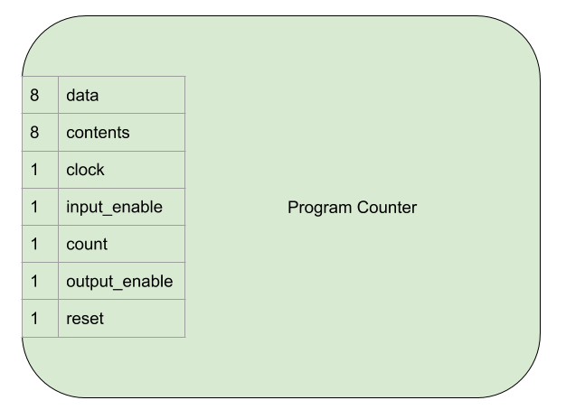

Program Counter
===============

The program counter stores an eight bit number used to track the
current position/instruction in program memory.

It's similar to a regular register but has some extra functionality:

- It can add one to it's current value.
- It's value can be reset to 0.

Interface and Operation
-----------------------
  
This is the interface to the program counter:

This is how it operates:

+---------------+-----------+--------------------------------------------------------------------------------------------+
| Name          | Bit width | Description                                                                                |
+===============+===========+============================================================================================+
| data          | 8         | Reads bits from, or asserts bits onto this connection.                                     |
+---------------+-----------+--------------------------------------------------------------------------------------------+
| contents      | 8         | Always outputs the current value held in the program counter.                              |
+---------------+-----------+--------------------------------------------------------------------------------------------+
| clock         | 1         | Clock signal from the clock module.                                                        |
+---------------+-----------+--------------------------------------------------------------------------------------------+
| input_enable  | 1         | While high, the program counter stores the value on data on a rising clock edge.           |
+---------------+-----------+--------------------------------------------------------------------------------------------+
| count         | 1         | While high, the program counter increments the stored value by one on a rising clock edge. |
+---------------+-----------+--------------------------------------------------------------------------------------------+
| output_enable | 1         | While high, the program counter asserts it's content onto data.                            |
+---------------+-----------+--------------------------------------------------------------------------------------------+

Implementation
--------------

- Two 74HCT161s are used to store, increment and clear the 8 bit value.
- A 74HCT245 is used to provide a tri state output to allow asserting
  values onto the bus, or not.
- A 74HCT04 is used to invert the incoming input_enable, output_enable
  and count signals to drive the active low inputs on the 74HCT161s and
  74HCT245.
- LEDs with current limiting resistors are used to display the current
  contents.

The electronics are laid out on the breadboard like so:

.. image:: images/program_counter/program_counter_bb.png
    :width: 100%