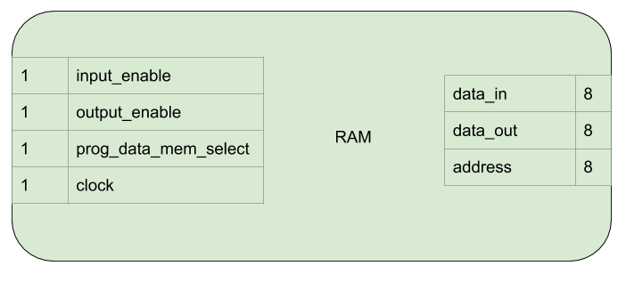
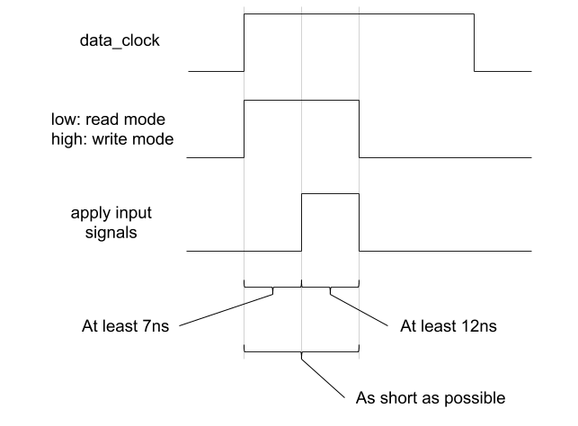
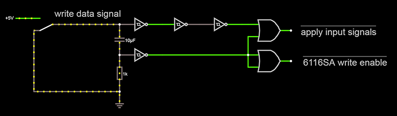
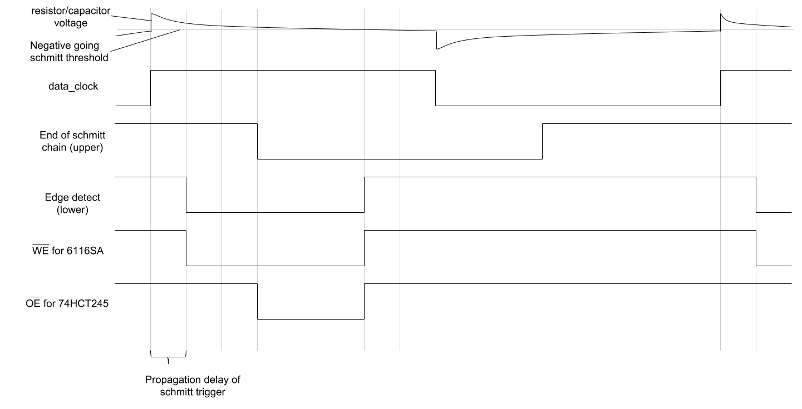

RAM
===

The RAM provides 256 bytes of program memory (instruction bytes) and 256
bytes of data memory (global variables and the stack).

Interface and Operation
-----------------------

This is the interface of the RAM:

This is how it operates:

+----------------------+-----------+-----------------------------------------------------------------------------------------------------------+
| Name                 | Bit width | Description                                                                                               |
+======================+===========+===========================================================================================================+
| data_in              | 8         | Data to be stored is read from here.                                                                      |
+----------------------+-----------+-----------------------------------------------------------------------------------------------------------+
| data_out             | 8         | Data at current address is output here.                                                                   |
+----------------------+-----------+-----------------------------------------------------------------------------------------------------------+
| address              | 8         | Index in memory to read from or write to.                                                                 |
+----------------------+-----------+-----------------------------------------------------------------------------------------------------------+
| input_enable         | 1         | While high, the data on data_in will be stored at the currently seleceted address on a rising clock egde. |
+----------------------+-----------+-----------------------------------------------------------------------------------------------------------+
| output_enable        | 1         | While high, the RAM asserts the data at the currently selected address onto data_out.                     |
+----------------------+-----------+-----------------------------------------------------------------------------------------------------------+
| prog_data_mem_select | 1         | When low, address operations are in program memory, when high - data memory.                              |
+----------------------+-----------+-----------------------------------------------------------------------------------------------------------+
| clock                | 1         | Data is written on a rising clock edge when input_enable is high.                                         |
+----------------------+-----------+-----------------------------------------------------------------------------------------------------------+

Implementation
--------------

Combined Input/Output pins
^^^^^^^^^^^^^^^^^^^^^^^^^^

Unlike the 74LS189 chip that :ref:`ben_eater` uses for his RAM, the 6116SA
used in this computer has combined input and output pins. This means
that care is required not to apply signals to those pins at incorrect
times. A tri state buffer is used on the input to achieve this. The
connections from the input/output pins on the RAM chip and the 74HCT245
tri state buffers are arranged like this:

.. image:: images/ram/input_output_buffers.png

Timing for Safely Writing Data
^^^^^^^^^^^^^^^^^^^^^^^^^^^^^^

Most of the time the RAM chip is in read mode. This means that the chip
is asserting the data stored in the address currently specified on the
address pins to the input/output pins. When it's time to write, the chip
needs to switch to write mode. To simplify control circuitry, only the
write enable (active low) input is used to control switching between
read and write mode (output enable (active low) is available as well).

It takes time for the chip to switch modes and the pins to change from
output to input. This time is referred to as tWHZ in the datasheet and
the following note applies:

.. note::
    4. During this period, the I/O pins are in the output state and the
       input signals must not be applied.

According to the datasheet tWHZ is at most 7ns for the 6116SA15
being used.

As well as the time taken for the pins to change state, we need to
ensure that the overall write pulse width is a certain length due to
another note in the datasheet (which applies because _OE will be low):

.. note::
    7. _OE is continuously HIGH. If _OE is LOW during a _WE controlled
       write cycle, the write pulse width must be the larger of tWP or
       (tWHZ + tDW) to allow the I/O drivers to turn off and data to be
       placed on the bus for the required tDW. If _OE is HIGH during a
       _WE controlled write cycle, this requirement does not apply and
       the write pulse is the specified tWP. For a _CS controlled write
       cycle, _OE may be LOW with no degradation to tCW.

tWP is listed as 12ns, but tWHZ + tDW (7ns + 12ns) is greater at 19ns so
the write pulse needs to be at least that long.

The chip is also not edge triggered - it will write data to the
specified address as long as it is in write mode. This means that we
need to do our own edge detection and keep the write pulse as short as
possible. See the :ref:`edge_detection` section for more details on that
process.

Once the write is finished, the chip can go instantly back into read
mode (as tDH is 0ns).

So with all this in mind, this is how the desired control signals would
look (assuming a write is to take place).

The output enable on the 74HCT245 and write enable on the 6116SA
are active low so the final circuit looks like this:

From left to right:

- The capacitor, resistor and inverting schmitt trigger on the bottom
  form the edge detector.
- The three inverting schmitt triggers on top serve to delay the signal
  (using propagation delay).
- The two OR gates ensure that once the low pulse from the detected
  rising edge finishes, both control signals go high at the same time.

The propagation delay of the inverting schmitt triggers (inside a
74HCT14) is approximately 20ns, to a maximum of approximately 40ns. With
the 3 schmitt triggers on top, the inversion of the now positive clock
is delayed between 60ns and 120ns.

The resitor and capacitor values are chosen so that the time from the
voltage between the capacitor and the resistor going high, to the
voltage going below the negative going threshold of the schmitt trigger
is at least 112ns. That is:

- 120ns for the longest possible delay for the top three schmitt triggers.
- Subtract 20ns for the shortest propogation delay from the edge detect schmitt trigger.
- 12ns to satisfy tDW

The 7ns required for tWHZ is amply catered for by the chained schmitt
triggers.

The final control signals look like this:

Setup Mode
^^^^^^^^^^

