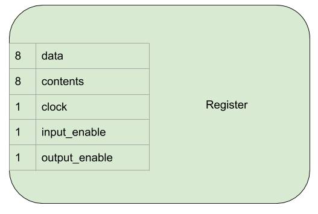

Register
========

A register stores an 8 bit number. In the computer registers are
connected to the bus and can read a value from the bus or assert a value
onto the bus. They also provide an output which is the currently stored
value.

At the simplest level, a register looks like this:

+---------------+-----------+---------------------------------------------------------------------------------------------+
| Name          | Bit width | Description                                                                                 |
+===============+===========+=============================================================================================+
| data          | 8         | Reads bits from, or asserts bits onto this connection                                       |
+---------------+-----------+---------------------------------------------------------------------------------------------+
| contents      | 8         | Always outputs the current value held in the register                                       |
+---------------+-----------+---------------------------------------------------------------------------------------------+
| clock         | 1         | Clock signal from the clock module                                                          |
+---------------+-----------+---------------------------------------------------------------------------------------------+
| input enable  | 1         | Controls whether the register reads data from the bust at the next rising edge of the clock |
+---------------+-----------+---------------------------------------------------------------------------------------------+
| output enable | 1         | Controls whether the register asserts it's content onto the data connection                 |
+---------------+-----------+---------------------------------------------------------------------------------------------+

