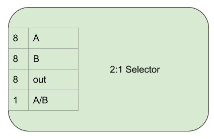
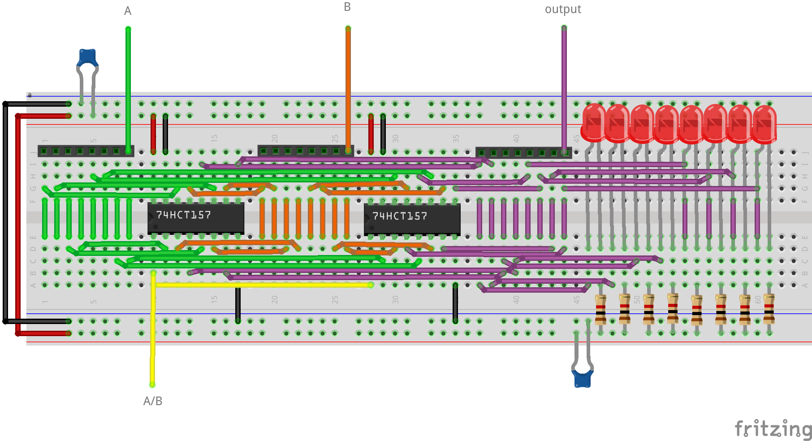

2:1 Selector
============

The 2:1 selector outputs one of two 8 bit inputs. Also known as a multiplexer.

Interface and Operation
-----------------------

This is the interface of a 2:1 selector:

This is how it operates:

+------+-----------+-----------------------------------------------+
| Name | Bit width | Description                                   |
+======+===========+===============================================+
| A    | 8         | First input                                   |
+------+-----------+-----------------------------------------------+
| B    | 8         | Second input                                  |
+------+-----------+-----------------------------------------------+
| out  | 8         | Output, either A or B.                        |
+------+-----------+-----------------------------------------------+
| A/B  | 1         | When low, A is output, when high, b is output |
+------+-----------+-----------------------------------------------+

Implementation
--------------

- Two 74HCT157s are used to choose between the two inputs.
- LEDs with current limiting resistors are used to display the output.

Due to 2:1 selectors being required in different parts of the computer,
the layout on the breadboard of A, B and out sometimes need to differ.

This is the `A B out` layout:

This is the `out A B` layout:

.. image:: images/two_to_one/two_to_one_O_A_B_bb.png
    :width: 100%

Different coloured wires are used in Fritzing to help track the A, B and
out bits. When creating the computer I only had green wire available :(.
